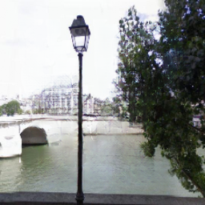

# EdgeConnect-Inpainting
The work is inspired from the paper of EdgeConnect Inpainting https://arxiv.org/abs/1901.00212

## Instructions
Download the pretrained weights by following the steps in the ipynb file.
You'll be needed to manually upload the images and masks on the colab in the required folder.

